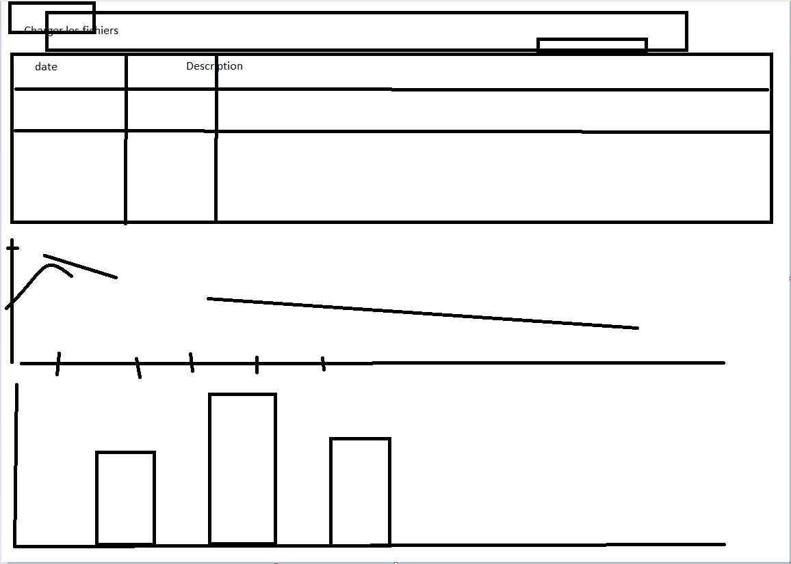

# FinanceMaster
0# Installer les dépendance : **npm i** (npm install)

1# Lancer le serveur : **npm run dev**
si npm n'est pas reconnu il faut installer nodejs

2# Se connecter à l'addresse : **localhost:3000**
dans le navigateur

# Diagramme

